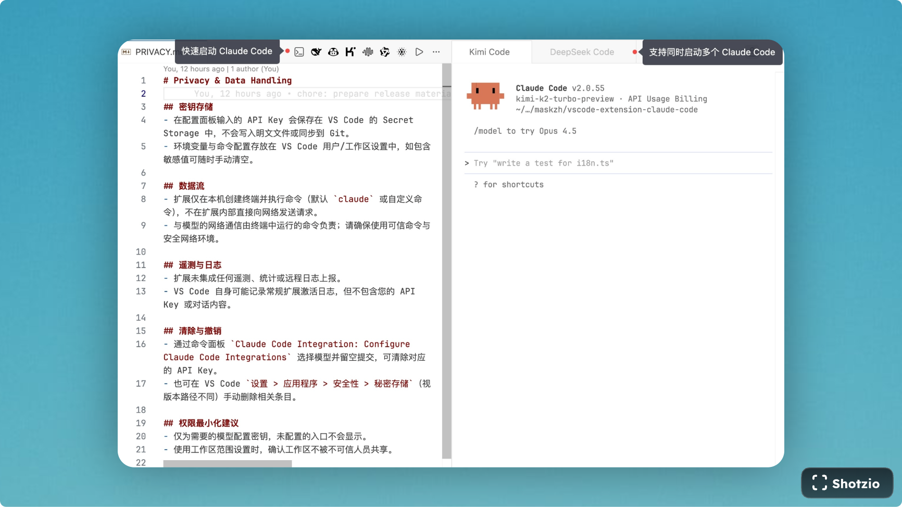

# Claude Code Integration

[English](#english) | [中文](#中文)

---

# English

## Overview

Claude Code Integration is a VS Code extension that launches multiple Anthropic-compatible AI terminals (Qwen, Kimi, DeepSeek, Zhipu, Minimax, GitHub Copilot, Custom) right from the editor title bar. Icons stay hidden until a model is configured, keeping the toolbar clean.

## Features

- Seven entries: Qwen, Kimi, DeepSeek, Zhipu, Minimax, GitHub Copilot, Custom (icons appear only after configuration)
- Quick Configure: `Claude Code Integration: Configure Claude Code Integrations` shows status and opens per-model API key input (stored in VS Code Secret Storage)
- Per-model defaults: Pre-filled `ANTHROPIC_BASE_URL` values; fallback to sensible defaults if settings are cleared
- Command override: If a custom command is set, it runs as-is; otherwise the extension injects env exports then runs `claude`
- Theme-aware icons: Ships light/dark SVG variants for all built-in providers; VS Code switches automatically with your theme
- i18n: Auto switches between English and Chinese based on VS Code language

## Installation

### From VS Code Marketplace

1. Open VS Code
2. Go to Extensions (`Ctrl+Shift+X` / `Cmd+Shift+X`)
3. Search for "Claude Code Integration"
4. Click Install

### Manual Installation

1. Download the latest `.vsix` file from [releases](https://github.com/maskzh/vscode-extension-claude-code/releases)
2. Open VS Code
3. Run `Extensions: Install from VSIX`
4. Select the downloaded `.vsix` file

## Usage

### Quick Start

1. Run `Claude Code Integration: Configure Claude Code Integrations` (or click the gear icon in the editor title bar)
2. Pick a model and paste its API Key (stored securely); adjust base URL or command if needed
3. Open any file and click a model icon in the editor title bar to open a side terminal
4. Configure other providers as needed; only configured models show icons

### Commands

| Command          | Description           | Entry point           |
| ---------------- | --------------------- | --------------------- |
| `Qwen`           | Launch Qwen Code      | Editor title-bar icon |
| `Kimi`           | Launch Kimi Code      | Editor title-bar icon |
| `DeepSeek`       | Launch DeepSeek Code  | Editor title-bar icon |
| `Zhipu`          | Launch Zhipu Code     | Editor title-bar icon |
| `Minimax`        | Launch Minimax Code   | Editor title-bar icon |
| `GitHub Copilot` | Launch Copilot Code   | Editor title-bar icon |
| `Custom`         | Launch Custom Code    | Editor title-bar icon |
| `Configure`      | Open configuration UI | Editor title-bar gear |

### Configuration

Two ways:

- Command Palette: `Claude Code Integration: Configure Claude Code Integrations` → pick a model → enter API Key (hidden) or clear it.
- Settings: `File > Preferences > Settings` → search `Claude Code Integration`.

### Complete Default Environment Variables

Each service comes with pre-configured model names and settings:

| Service            | ANTHROPIC_BASE_URL                                             | ANTHROPIC_DEFAULT_OPUS_MODEL | ANTHROPIC_DEFAULT_SONNET_MODEL | ANTHROPIC_DEFAULT_HAIKU_MODEL |
| ------------------ | -------------------------------------------------------------- | ---------------------------- | ------------------------------ | ----------------------------- |
| **Qwen**           | `https://dashscope.aliyuncs.com/api/v2/apps/claude-code-proxy` | `qwen3-coder-plus`           | `qwen3-coder-plus`             | `qwen3-coder-plus`            |
| **Kimi**           | `https://api.moonshot.cn/anthropic`                            | `kimi-k2-turbo-preview`      | `kimi-k2-turbo-preview`        | `kimi-k2-turbo-preview`       |
| **DeepSeek**       | `https://api.deepseek.com/anthropic`                           | `deepseek-chat`              | `deepseek-chat`                | `deepseek-chat`               |
| **Zhipu**          | `https://open.bigmodel.cn/api/anthropic`                       | `glm-4.6`                    | `glm-4.6`                      | `glm-4.6-air`                 |
| **Minimax**        | `https://api.minimax.io/anthropic`                             | `MiniMax-M2`                 | `MiniMax-M2`                   | `MiniMax-M2`                  |
| **GitHub Copilot** | _(empty)_ [^copilot]                                           | `claude-opus-4.5`            | `claude-sonnet-4.5`            | `claude-haiku-4.5`            |
| **Custom**         | _(empty)_                                                      | `claude-opus-4.5`            | `claude-sonnet-4.5`            | `claude-haiku-4.5`            |

**Note:** All services include `CLAUDE_CODE_DISABLE_NONESSENTIAL_TRAFFIC: 1` to optimize network usage.

[^copilot]: Use [copilot-api](https://github.com/ericc-ch/copilot-api) to build your own GitHub Copilot proxy service.

Command override tips:

- Leave the command empty to run bundled `claude` with env exports injected.
- Set any non-empty command to run it directly (no env injection in this mode).
- A model icon shows up only when it has an API Key + Base URL, **or** a custom command is set.
- **Important:** If you set a custom command, the extension executes it verbatim and will not inject any env variables—include needed exports inside your command if required.
- Why allow custom commands? You can keep API keys out of VS Code by defining a shell alias/function that exports env vars, then point the extension to that command. Example (`~/.zshrc`):
  ```bash
  function deepseek() {
    ANTHROPIC_BASE_URL="https://api.deepseek.com/anthropic" \
    ANTHROPIC_AUTH_TOKEN="$DEEPSEEK_API_KEY" \
    ANTHROPIC_DEFAULT_OPUS_MODEL="deepseek-chat" \
    ANTHROPIC_DEFAULT_SONNET_MODEL="deepseek-chat" \
    ANTHROPIC_DEFAULT_HAIKU_MODEL="deepseek-chat" \
    claude "$@"
  }
  ```
  Then set the command to `deepseek` in settings.

## Development

### Prerequisites

- Node.js 18+
- VS Code 1.102+
- npm

### Setup

```bash
# Clone repository
git clone https://github.com/maskzh/vscode-extension-claude-code.git
cd vscode-extension-claude-code

# Install dependencies
npm install

# Compile TypeScript
npm run compile

# Watch for changes during development
npm run watch

# Run linting
npm run lint

# Package extension
npm run package
```

### Debugging

1. Open project in VS Code
2. Press `F5` to open Extension Development Host
3. Test the extension in the new window

### Additional Documentation

- **[Privacy & Data Handling](PRIVACY.md)** - Learn how API keys are stored and data is handled securely
- **[Development Guide](DEVELOPMENT.md)** - Comprehensive development documentation and contribution guidelines

## License

This project is licensed under the MIT License - see the [LICENSE](LICENSE) file for details.

---

# 中文



## 概述

Claude Code Integration 是一个 VS Code 扩展，可在编辑器标题栏一键启动多家 Anthropic 兼容模型终端：通义千问、月之暗面、DeepSeek、智谱、Minimax、GitHub Copilot 以及自定义端点。只有完成配置的模型才会显示图标，避免工具栏冗余。

## 功能特性

- 七个内置入口：Qwen、Kimi、DeepSeek、Zhipu、Minimax、GitHub Copilot、Custom（未配置时自动隐藏图标）
- 快速配置面板：`Claude Code Integration: Configure Claude Code Integrations` 列出各模型状态，可直接录入/清空 API Key（保存在 VS Code Secret Storage）
- 按模型预置 Base URL：默认填好 `ANTHROPIC_BASE_URL`，可随时修改
- 命令覆盖策略：若填写自定义命令则直接执行；否则注入环境变量后运行默认 `claude`
- 适配亮/暗主题：所有内置模型提供 light/dark SVG 图标，随 VS Code 主题自动切换
- 自动多语言：根据 VS Code 语言自动切换中英文提示

## 安装方式

### 从 VS Code 市场安装

1. 打开 VS Code
2. 进入扩展 (`Ctrl+Shift+X` / `Cmd+Shift+X`)
3. 搜索 "Claude Code Integration"
4. 点击安装

### 手动安装

1. 从 [releases](https://github.com/maskzh/vscode-extension-claude-code/releases) 下载最新 `.vsix`
2. 打开 VS Code
3. 运行 `Extensions: Install from VSIX`
4. 选择下载的文件

## 使用指南

### 快速开始

1. 运行命令面板 `Claude Code Integration: Configure Claude Code Integrations`（或点标题栏齿轮）
2. 选择模型并粘贴 API Key；需要时修改 Base URL 或命令
3. 打开任意文件，点击标题栏对应模型图标即可在侧边开启终端
4. 对其他模型重复操作，未配置的模型不会显示图标

### 命令列表

| 命令             | 描述               | 默认入口         |
| ---------------- | ------------------ | ---------------- |
| `Qwen`           | 启动 Qwen Code     | 编辑器标题栏图标 |
| `Kimi`           | 启动 Kimi Code     | 编辑器标题栏图标 |
| `DeepSeek`       | 启动 DeepSeek Code | 编辑器标题栏图标 |
| `Zhipu`          | 启动 Zhipu Code    | 编辑器标题栏图标 |
| `Minimax`        | 启动 Minimax Code  | 编辑器标题栏图标 |
| `GitHub Copilot` | 启动 Copilot Code  | 编辑器标题栏图标 |
| `Custom`         | 启动自定义 Code    | 编辑器标题栏图标 |
| `Configure`      | 打开扩展设置       | 编辑器标题栏齿轮 |

### 配置说明

两种入口：

- 命令面板：`Claude Code Integration: Configure Claude Code Integrations` → 选择模型 → 输入或清空 API Key（输入会隐藏，存入 Secret Storage）。
- 设置页：`文件 > 首选项 > 设置`，搜索 `Claude Code Integration` 逐项编辑。

### 完整的默认环境变量配置

每个服务都预配置了对应的模型名称和设置：

| 服务               | ANTHROPIC_BASE_URL                                             | ANTHROPIC_DEFAULT_OPUS_MODEL | ANTHROPIC_DEFAULT_SONNET_MODEL | ANTHROPIC_DEFAULT_HAIKU_MODEL |
| ------------------ | -------------------------------------------------------------- | ---------------------------- | ------------------------------ | ----------------------------- |
| **通义千问**       | `https://dashscope.aliyuncs.com/api/v2/apps/claude-code-proxy` | `qwen3-coder-plus`           | `qwen3-coder-plus`             | `qwen3-coder-plus`            |
| **月之暗面**       | `https://api.moonshot.cn/anthropic`                            | `kimi-k2-turbo-preview`      | `kimi-k2-turbo-preview`        | `kimi-k2-turbo-preview`       |
| **DeepSeek**       | `https://api.deepseek.com/anthropic`                           | `deepseek-chat`              | `deepseek-chat`                | `deepseek-chat`               |
| **智谱**           | `https://open.bigmodel.cn/api/anthropic`                       | `glm-4.6`                    | `glm-4.6`                      | `glm-4.6-air`                 |
| **Minimax**        | `https://api.minimax.io/anthropic`                             | `MiniMax-M2`                 | `MiniMax-M2`                   | `MiniMax-M2`                  |
| **GitHub Copilot** | _(留空)_ [^copilot]                                            | `claude-opus-4.5`            | `claude-sonnet-4.5`            | `claude-haiku-4.5`            |
| **Custom**         | _(留空)_                                                       | `claude-opus-4.5`            | `claude-sonnet-4.5`            | `claude-haiku-4.5`            |

**注意：** 所有服务都包含 `CLAUDE_CODE_DISABLE_NONESSENTIAL_TRAFFIC: 1` 以优化网络使用。

[^copilot]: 使用 [copilot-api](https://github.com/ericc-ch/copilot-api) 构建你自己的 GitHub Copilot 代理服务。

命令覆盖要点：

- 命令留空时，扩展会先注入环境变量再执行 `claude`。
- 只要命令非空且不等于默认 `claude`，扩展就直接执行该命令（不再注入 env）。
- 只要存有 API Key 且 Base URL 非空，或设置了自定义命令，对应模型的图标就会显示。
- **重要提醒：** 一旦填写自定义命令，扩展会原样执行该命令，不再为你注入任何环境变量，如需变量请在命令中自行处理。
- 为什么允许自定义命令？你可以不在 VS Code 里存 API Key，而是在 `~/.zshrc` 定义函数/别名自行导出变量，然后在设置里填这个命令。例如：
  ```bash
  function deepseek() {
    ANTHROPIC_BASE_URL="https://api.deepseek.com/anthropic" \
    ANTHROPIC_AUTH_TOKEN="$DEEPSEEK_API_KEY" \
    ANTHROPIC_DEFAULT_OPUS_MODEL="deepseek-chat" \
    ANTHROPIC_DEFAULT_SONNET_MODEL="deepseek-chat" \
    ANTHROPIC_DEFAULT_HAIKU_MODEL="deepseek-chat" \
    claude "$@"
  }
  ```
  在扩展设置中把命令写成 `deepseek` 即可。

## 开发指南

### 环境要求

- Node.js 18+
- VS Code 1.102+
- npm

### 开发设置

```bash
# 克隆仓库
git clone https://github.com/maskzh/vscode-extension-claude-code.git
cd vscode-extension-claude-code

# 安装依赖
npm install

# 编译 TypeScript
npm run compile

# 开发时监听文件变化
npm run watch

# 运行代码检查
npm run lint

# 打包扩展
npm run package
```

### 调试方法

1. 在 VS Code 中打开项目
2. 按 `F5` 打开扩展开发主机
3. 在新窗口中测试扩展

### 更多文档

- **[隐私与数据处理](PRIVACY.md)** - 了解 API Key 的存储方式和数据安全处理
- **[开发指南](DEVELOPMENT.md)** - 完整的开发文档和贡献指南
